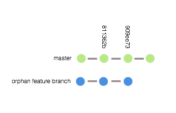

## Rebasing an Orphaned Branch

We wanted to give people a good example of how they can remedy a situation of an orphaned branch that needs to be spliced into an existing branch. Here is an example of what this situation could look like:



What we really need to do is get the `feature` branch added to the master branch at commit 811362b with the rest of the commits added after the feature branch's commit. This is what we need the final output to look like:


### Getting Started

The first thing we want to do is create a new branch from master at the 811362b commit. Let's create that new branch now and call it `combined` and create it from the point that we want to inject the feature branch: 

`git branch combined 811362b`

Now we have three branches: `master`, `feature` and `combined`. Now that we have this third branch that we are using to combine the other branches we can add the `feature` branch to it. Let's do that by using the rebase feature. We will use the `combined` branch as the base and add the feature branch to it:

`git rebase combined feature`

This will print out feedback that looks like this:  
```
First, rewinding head to replay your work on top of it...
Applying: A random change of 11622 to orphan1.md
Applying: A random change of 4947 to orphan2.md
Applying: A random change of 21310 to orphan3.md
```

The resulting branches will be:


We now have the `feature` branch added onto the end of the `combined` branch. But we still need the two commits at the end of the `master` branch to be added onto the `combined` branch. Let's do that by rebasing master onto combined with `rebased --onto`:

`git rebase --onto feature combined master`

This will print out feedback that looks like this:
```
First, rewinding head to replay your work on top of it...
Applying: A random change of 17877 to main3.md
Applying: A random change of 11338 to main4.md
```

The resulting branches will look like our expected output as the `master` branch has been added to the `combined` branch. Here is what we are left with after branch cleanup:


We now have inserted the feature branch into the master branch and have a clean line of history. However, that brings up an important `warning`. When using rebase you rewrite history. Because the sha of each rebased commit has been changed you are now out of sync with origin and anyone else's branch. If this has been done on the main server before making the repo available there shouldn't be an issue. If this has been done in an actively used repo you will need to force push your changes to the server and coordinate with everyone who has the codebase to make sure they get the new changes. A `force` push should be a **very** rare occurrence.  


