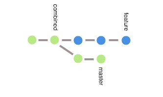

## Rebasing an Orphaned Branch

### A Word of Caution
When using rebase you rewrite history. Because the SHA of each rebased commit has been changed you are now out of sync with origin and anyone else's branch. If this has been done on the main server before making the repo available there shouldn't be an issue. If this has been done in an actively used repo you will need to force push your changes to the server and coordinate with everyone who has the codebase to make sure they get the new changes. A `force` push should be a **very** rare occurrence.  

This example provides you with a solution to remedy an orphaned branch that needs to be spliced into an existing branch. Here is an example of what this situation could look like:


The feature branch needs to be added to the master branch at commit 811362b with the rest of the commits from master being added after the feature branch's commits. This is what the final output should look like:


### Getting Started

Create a new branch from master at the 811362b commit. Call it `combined` (or something other descriptive name that implies intent) and create it from the point where the feature branch will be injected:

`git branch combined 811362b`

Now there are three branches: master, feature and combined. Use the rebase command to add the feature branch to the combined branch:

`git rebase combined feature`

This will print out feedback that looks like this:  
```
First, rewinding head to replay your work on top of it...
Applying: A random change of 11622 to orphan1.md
Applying: A random change of 4947 to orphan2.md
Applying: A random change of 21310 to orphan3.md
```

The resulting branches will be:



The feature branch is now added to the end of the combined branch. The two commits at the end of the master branch need to be added onto the combined branch. Do that by rebasing master onto combined with `rebased --onto`:

`git rebase --onto feature combined master`

This will print out feedback that looks like this:
```
First, rewinding head to replay your work on top of it...
Applying: A random change of 17877 to main3.md
Applying: A random change of 11338 to main4.md
```

The resulting branches will look like the expected output. The master branch has been added to the combined branch. Here is what the repo looks like after branch cleanup:


